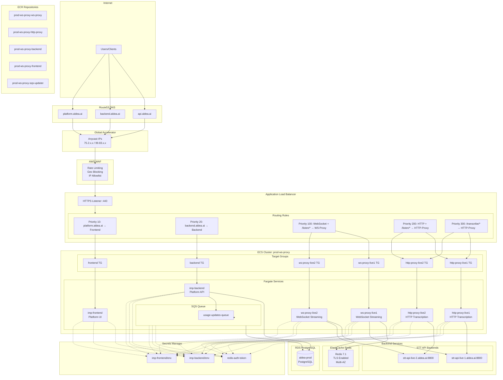
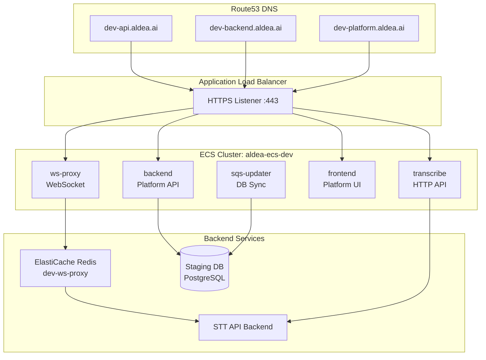
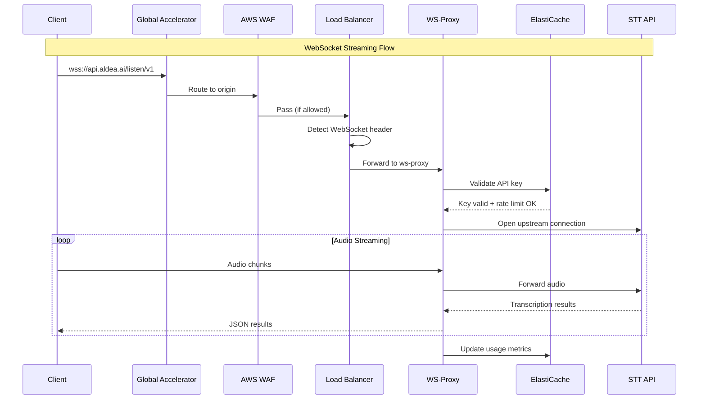
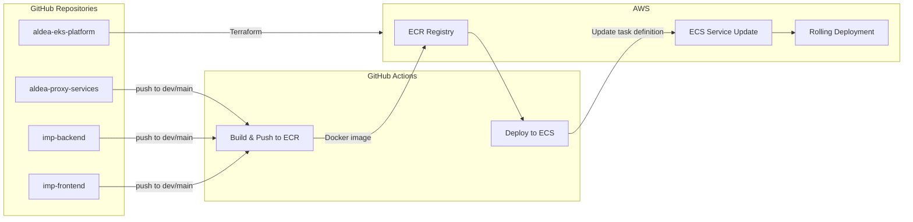

# Aldea ECS Architecture

## Overview

Current production architecture using AWS ECS Fargate for all ASR (Automatic Speech Recognition) services.

## Production ECS Cluster (prod-ws-proxy)

## Dev ECS Cluster (aldea-ecs-dev)

## Service Communication Flow

## CI/CD Pipeline Flow

