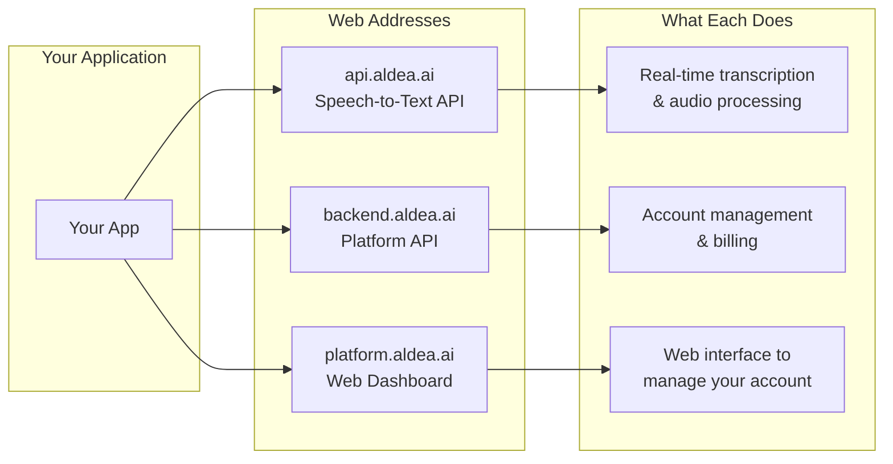
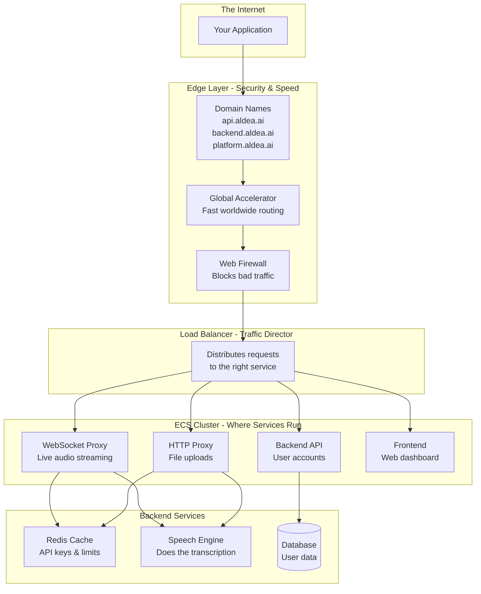
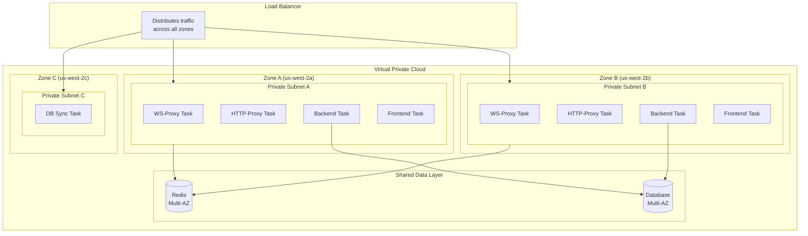
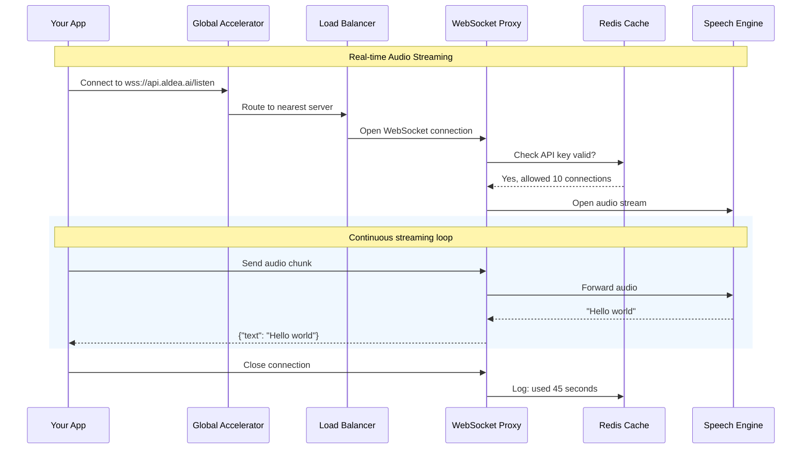
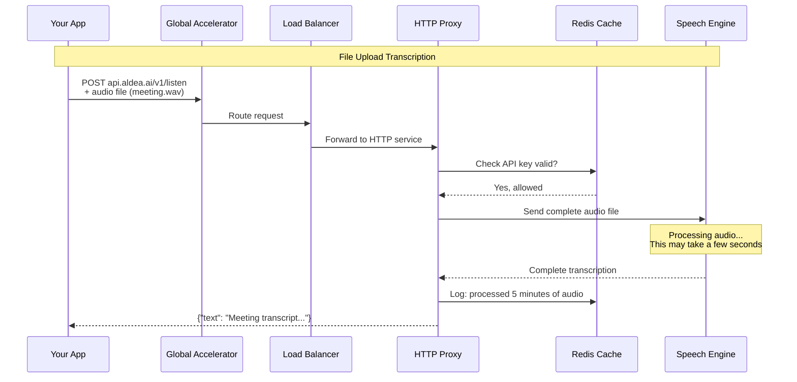
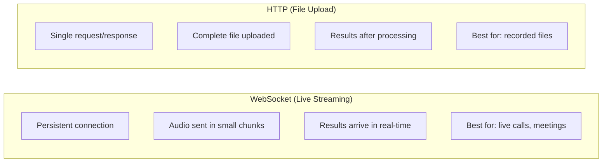
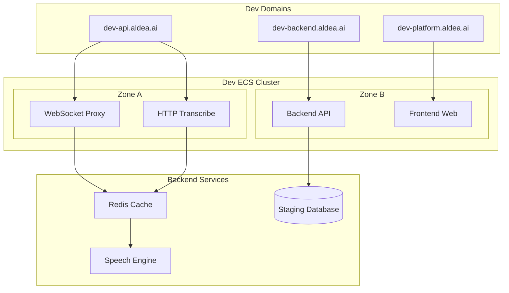
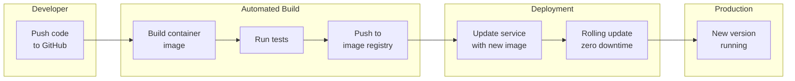

# Aldea ECS Architecture

## What is This?

This document shows how Aldea's speech-to-text (ASR) services run in the cloud using AWS ECS (Elastic Container Service). Think of ECS as a way to run applications in isolated containers without managing servers.

---

## How Users Connect to Aldea

---

## Production Architecture Overview

A simplified view of how requests flow through the system:

---

## Tasks Distributed Across Availability Zones

AWS runs services across multiple data centers (Availability Zones) for reliability. If one zone fails, others keep running.

---

## WebSocket Flow - Live Audio Streaming

For real-time transcription where audio streams continuously:

---

## HTTP Flow - File Upload Transcription

For uploading audio files to get transcription back:

---

## Key Differences: WebSocket vs HTTP

---

## Dev Environment

A smaller version for testing and development:

---

## How Code Gets Deployed

When developers push code changes:

