# Aldea ECS Architecture

## What is This?

This document shows how Aldea's speech-to-text (ASR) services run in the cloud using AWS ECS (Elastic Container Service). Think of ECS as a way to run applications in isolated containers without managing servers.

---

## How Users Connect to Aldea

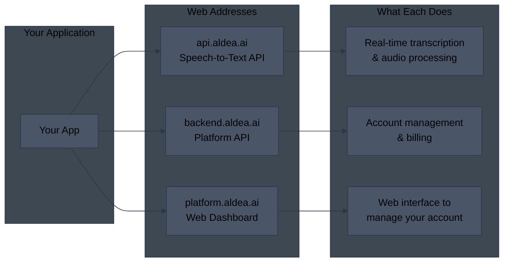

---

## Production Architecture Overview

A simplified view of how requests flow through the system:

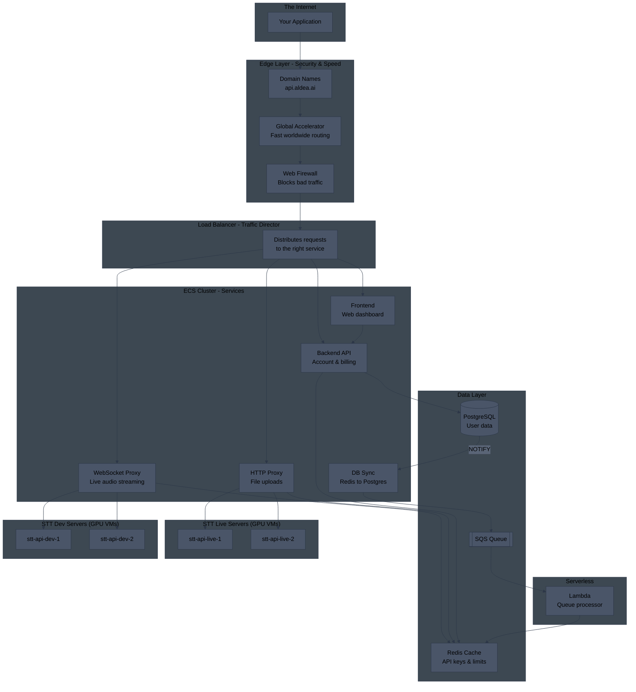

---

## Production Network Architecture (Multi-AZ)

Production and staging environments use **Multi-AZ deployments** for high availability. All critical resources are distributed across multiple Availability Zones.

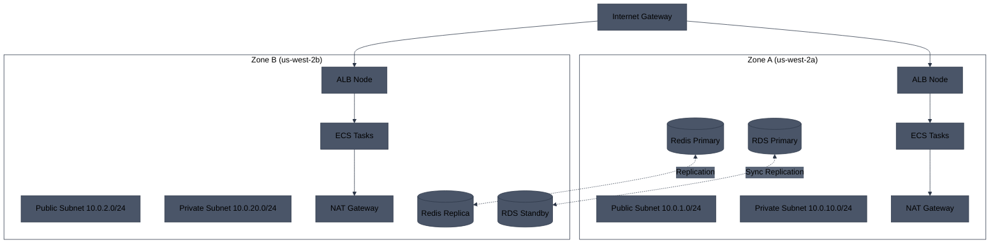

---

## Multi-AZ Resource Distribution

AWS runs services across multiple data centers (Availability Zones) for reliability. If one zone fails, others keep running.

| Resource | Multi-AZ in Prod/Staging | Single-AZ in Dev |
|----------|--------------------------|------------------|
| **ALB** | ✅ Nodes in 2 AZs | ✅ Nodes in 2 AZs |
| **ECS Tasks** | ✅ Distributed across 2 AZs | ⚠️ Single AZ |
| **ElastiCache Redis** | ✅ Primary + Replica in different AZs | ⚠️ Single node |
| **RDS PostgreSQL** | ✅ Multi-AZ with standby | ⚠️ Single instance |
| **NAT Gateway** | ✅ One per AZ (2 NATs) | ⚠️ Single NAT |
| **Subnets** | ✅ Public + Private in each AZ | ⚠️ Minimal subnets |

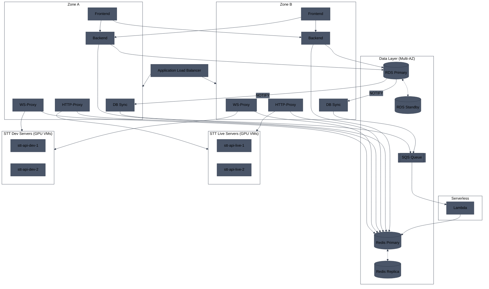

---

## WebSocket Flow - Live Audio Streaming

For real-time transcription where audio streams continuously:

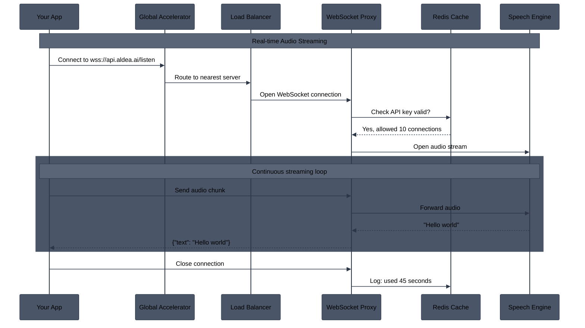

---

## HTTP Flow - File Upload Transcription

For uploading audio files to get transcription back:

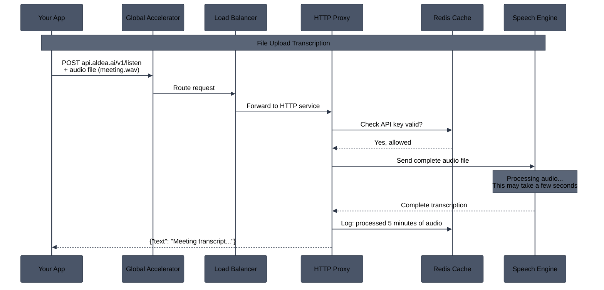

---

## Dev Environment (Single-AZ - Cost Optimized)

The dev environment uses **single-AZ deployments** to reduce costs. This is acceptable for development since uptime is not critical.

**Cost savings in Dev:**
- No Multi-AZ RDS standby (~50% RDS cost savings)
- Single Redis node instead of cluster (~50% ElastiCache savings)
- Single NAT Gateway (~66% NAT cost savings)
- Fewer ECS tasks

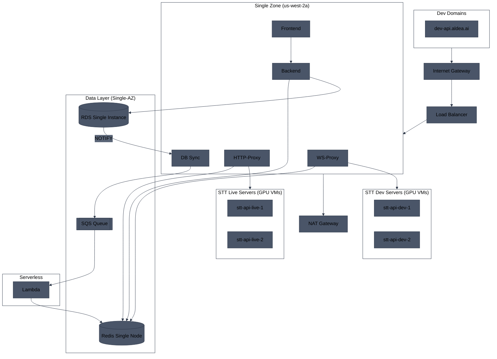

---

## Branching Strategy

All repositories follow this branching strategy:

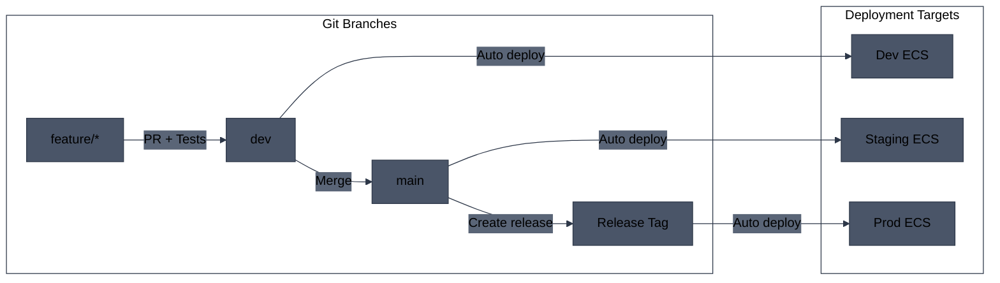

---

## CI Pipeline - Pull Requests

When a PR is opened, tests run automatically:

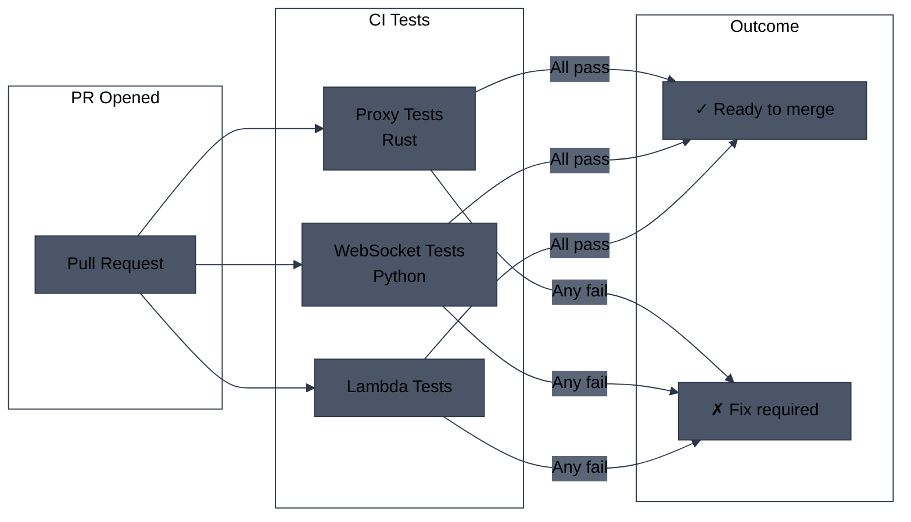

---

## Deployment Pipeline - aldea-proxy-services

Services: **ws-proxy**, **transcribe**

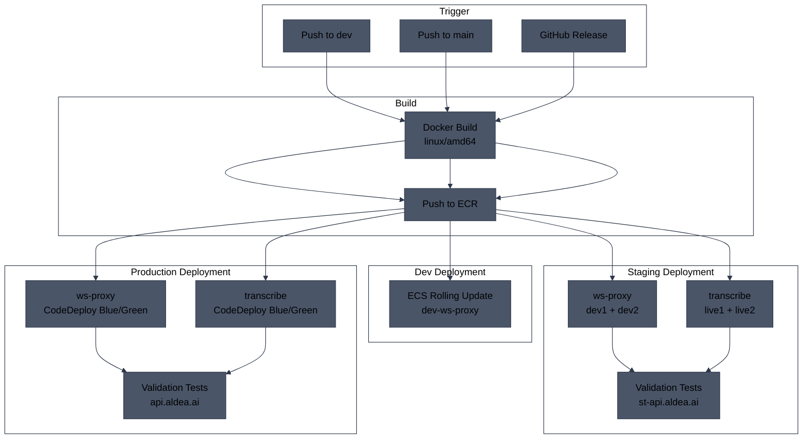

---

## Deployment Pipeline - imp-backend

Service: **Backend API**

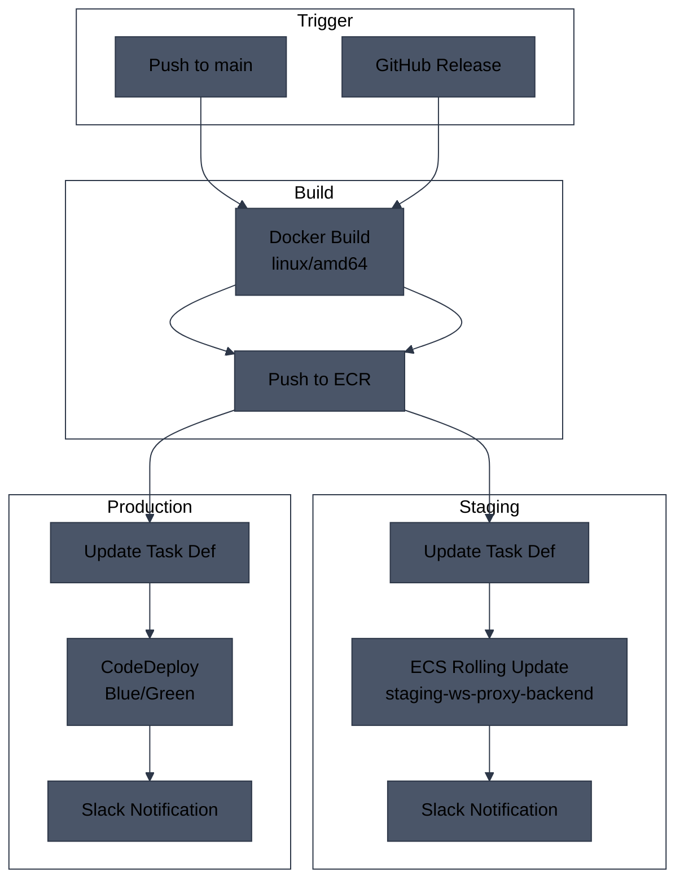

---

## Deployment Pipeline - imp-frontend

Service: **Frontend Web App**

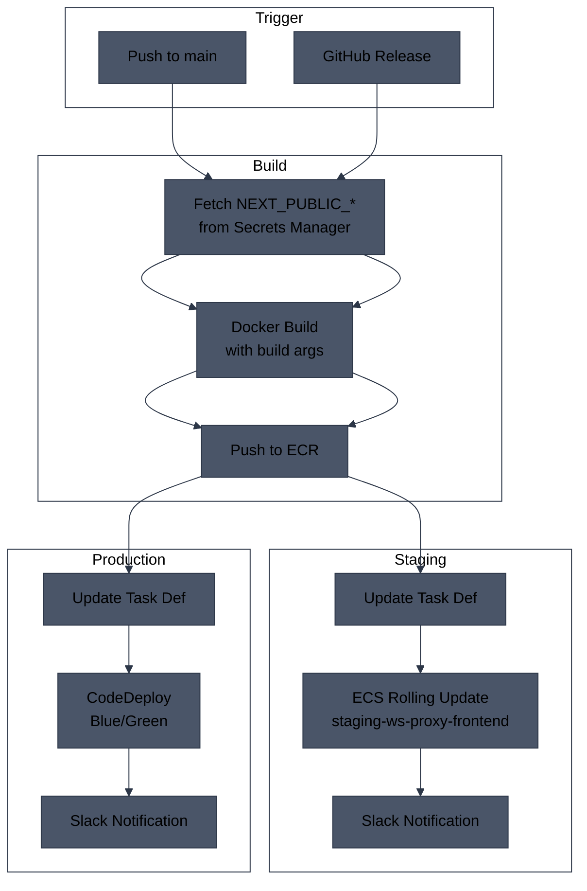

---

## CodeDeploy Blue/Green Deployment

Production services use CodeDeploy for zero-downtime deployments:

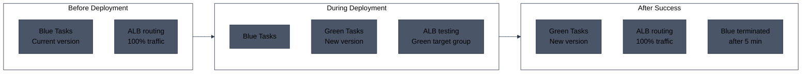

---

## Deployment Summary by Service

| Service | Repository | Dev | Staging | Production |
|---------|------------|-----|---------|------------|
| **ws-proxy** | aldea-proxy-services | ECS Rolling | ECS Rolling (×2) | CodeDeploy B/G |
| **transcribe** | aldea-proxy-services | ECS Rolling | ECS Rolling (×2) | CodeDeploy B/G |
| **Backend** | imp-backend | ECS Rolling | ECS Rolling | CodeDeploy B/G |
| **Frontend** | imp-frontend | ECS Rolling | ECS Rolling | CodeDeploy B/G |
| **DB Sync** | aldea-proxy-services | ECS Rolling | ECS Rolling | ECS Rolling |

---

## Environment Domains

Each environment has dedicated domains for all services:

| Service | Production | Staging | Dev |
|---------|------------|---------|-----|
| **ASR API** | api.aldea.ai | st-api.aldea.ai | dev-api.aldea.ai |
| **Backend API** | backend.aldea.ai | st-backend.aldea.ai | - |
| **Frontend** | platform.aldea.ai | st-frontend.aldea.ai | - |
| **Grafana** | grafana.aldea.ai | - | - |

### Domain Routing

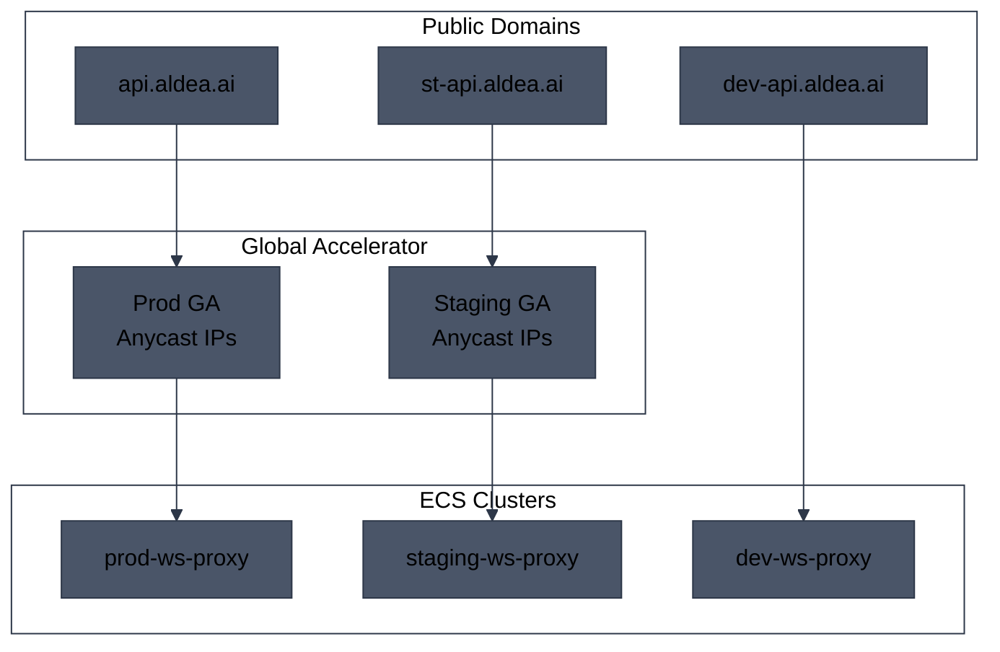

---

## Staging Environment

Staging mirrors production architecture but uses different STT server routing for testing.

### Staging Architecture

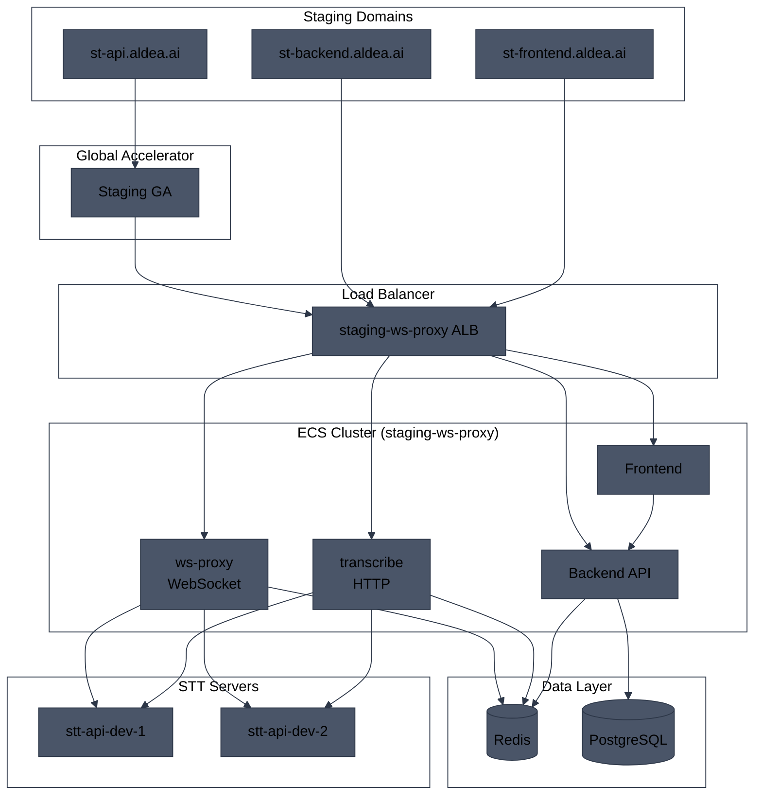

### Staging vs Production

| Aspect | Production | Staging |
|--------|------------|---------|
| **STT Servers** | stt-api-live-1, stt-api-live-2 | stt-api-dev-1, stt-api-dev-2 |
| **Multi-AZ** | Yes | Yes |
| **CodeDeploy** | Blue/Green | Rolling updates |
| **Global Accelerator** | Yes | Yes |
| **Redis** | Cluster mode | Cluster mode |

---

## Redis Seeding and Org Sync

API keys are cached in Redis for fast validation. The sync process ensures Redis stays up-to-date with the source database.

### Sync Architecture

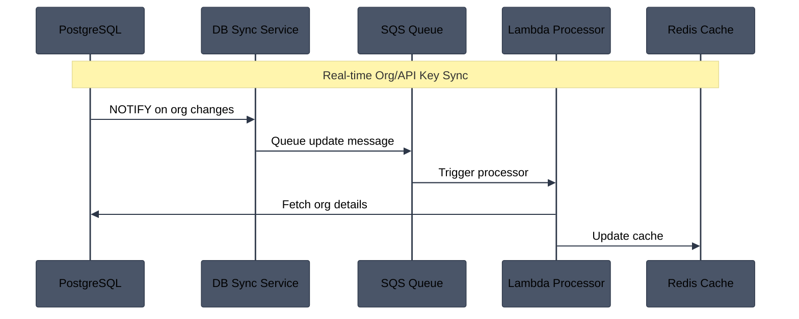

### Components

| Component | Description |
|-----------|-------------|
| **DB Sync Service** | ECS service listening for PostgreSQL NOTIFY events |
| **SQS Queue** | `prod-ws-proxy-org-sync` - buffers update messages |
| **Lambda Processor** | Processes queue messages and updates Redis |
| **Redis** | Caches org data with API keys and rate limits |

### Redis Data Structure

```
org:{org_id}:api_keys     # Set of API key hashes
org:{org_id}:limits       # Hash of rate limits
apikey:{key_hash}         # Points to org_id
```

### Initial Seeding

On deployment or Redis reset, initial seeding is triggered:

```bash
# Invoke Lambda to seed all orgs
AWS_PROFILE=aldea-prod aws lambda invoke \
  --function-name prod-ws-proxy-redis-seeder \
  --payload '{"seed_all": true}' \
  --region us-west-2 \
  /tmp/response.json
```
