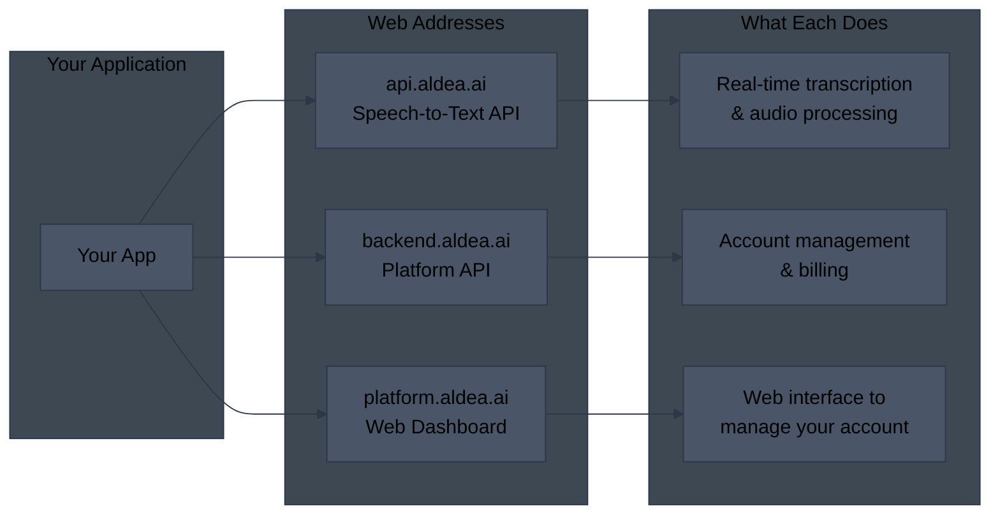
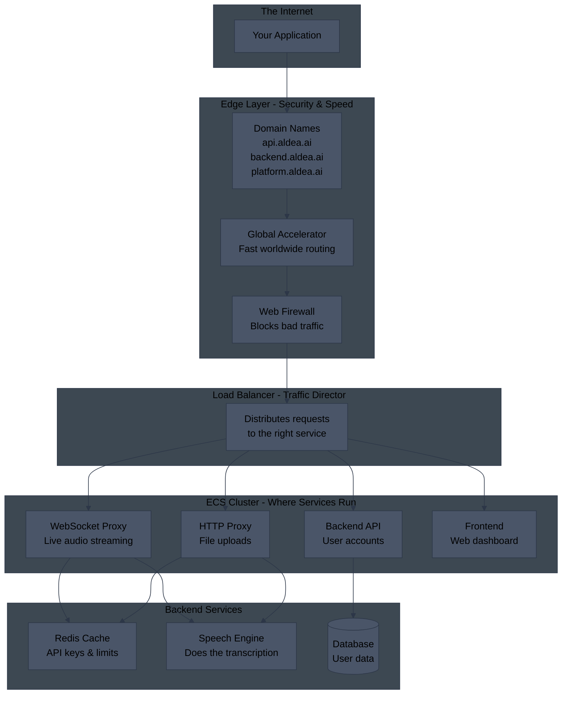
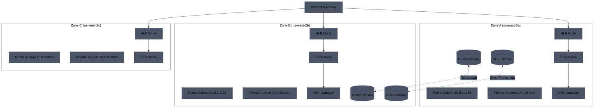
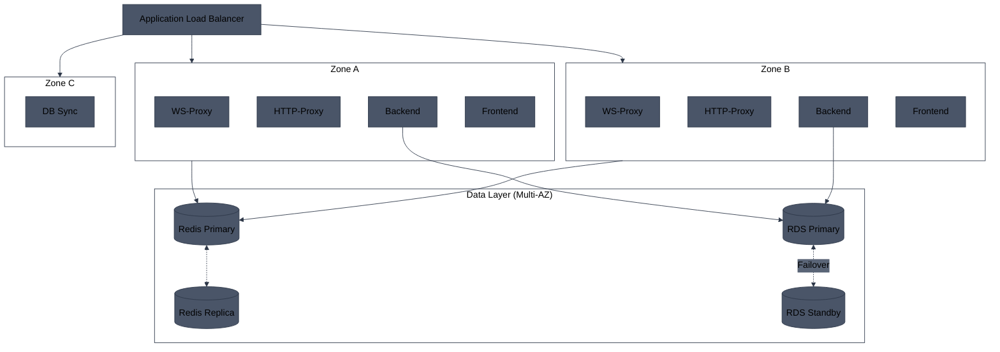
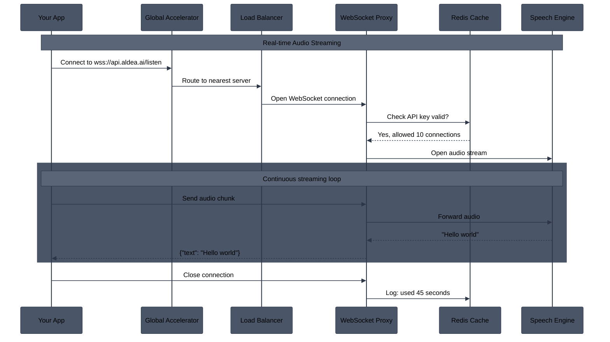
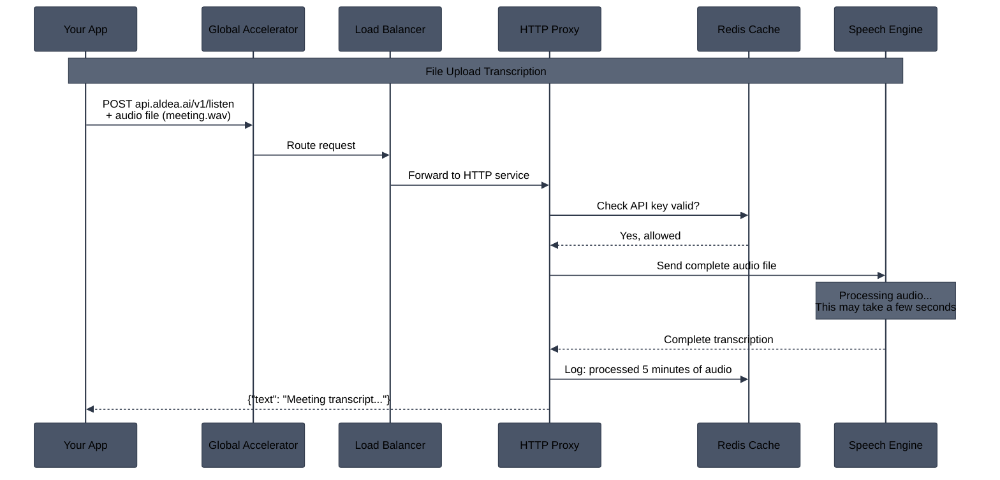
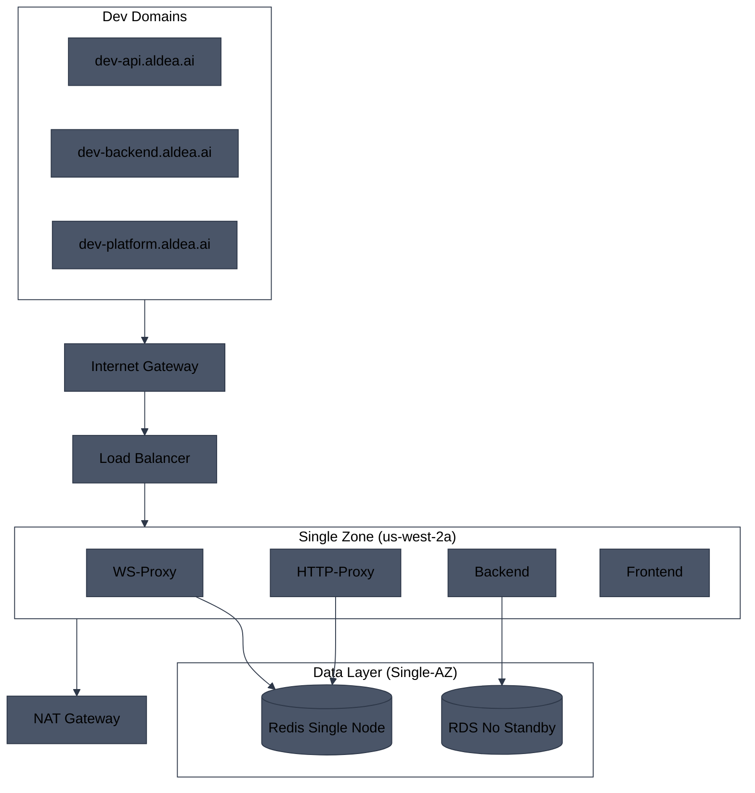
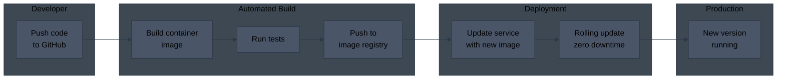

# Aldea ECS Architecture

## What is This?

This document shows how Aldea's speech-to-text (ASR) services run in the cloud using AWS ECS (Elastic Container Service). Think of ECS as a way to run applications in isolated containers without managing servers.

---

## How Users Connect to Aldea

---

## Production Architecture Overview

A simplified view of how requests flow through the system:

---

## Production Network Architecture (Multi-AZ)

Production and staging environments use **Multi-AZ deployments** for high availability. All critical resources are distributed across multiple Availability Zones.

---

## Multi-AZ Resource Distribution

AWS runs services across multiple data centers (Availability Zones) for reliability. If one zone fails, others keep running.

| Resource | Multi-AZ in Prod/Staging | Single-AZ in Dev |
|----------|--------------------------|------------------|
| **ALB** | ✅ Nodes in 3 AZs | ✅ Nodes in 2 AZs |
| **ECS Tasks** | ✅ Distributed across 3 AZs | ⚠️ Single AZ |
| **ElastiCache Redis** | ✅ Primary + Replica in different AZs | ⚠️ Single node |
| **RDS PostgreSQL** | ✅ Multi-AZ with standby | ⚠️ Single instance |
| **NAT Gateway** | ✅ One per AZ (2-3 NATs) | ⚠️ Single NAT |
| **Subnets** | ✅ Public + Private in each AZ | ⚠️ Minimal subnets |

---

## WebSocket Flow - Live Audio Streaming

For real-time transcription where audio streams continuously:

---

## HTTP Flow - File Upload Transcription

For uploading audio files to get transcription back:

---

## Dev Environment (Single-AZ - Cost Optimized)

The dev environment uses **single-AZ deployments** to reduce costs. This is acceptable for development since uptime is not critical.

**Cost savings in Dev:**
- No Multi-AZ RDS standby (~50% RDS cost savings)
- Single Redis node instead of cluster (~50% ElastiCache savings)
- Single NAT Gateway (~66% NAT cost savings)
- Fewer ECS tasks

---

## How Code Gets Deployed

When developers push code changes:

