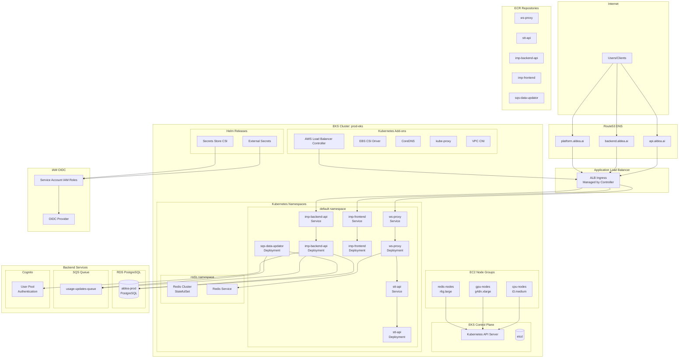
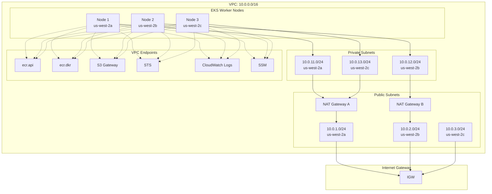
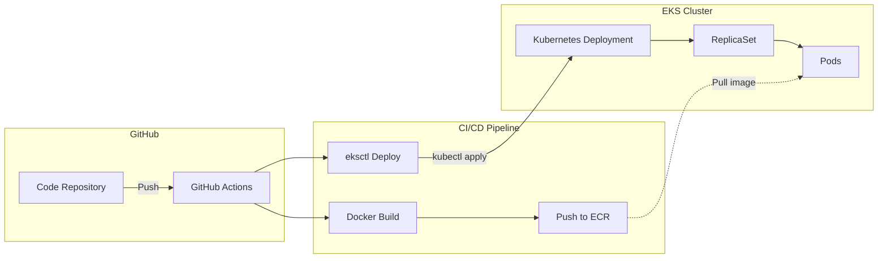
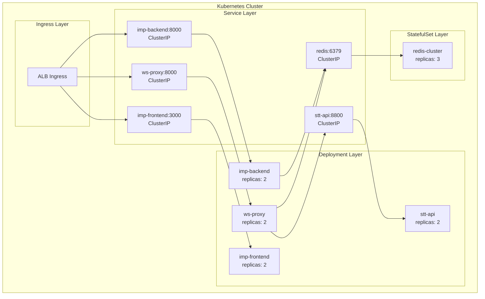
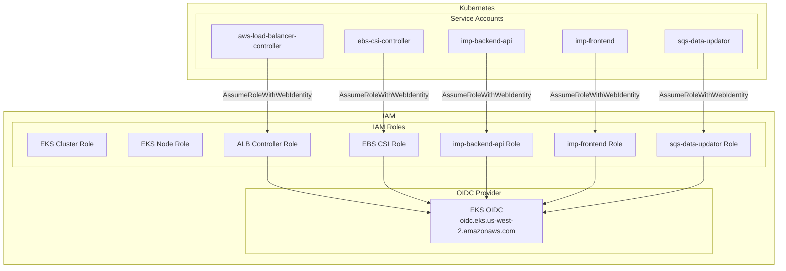

# Aldea EKS Architecture (Previous)

## Overview

Previous production architecture using AWS EKS with Kubernetes for workload orchestration. This architecture was replaced with ECS Fargate for simplified operations.

## Production EKS Cluster (prod-eks)

## EKS Networking Architecture

## EKS Deployment Model

## Kubernetes Service Architecture

## EKS IAM Architecture

