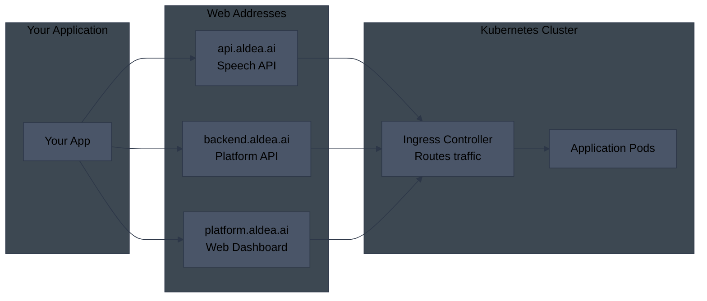
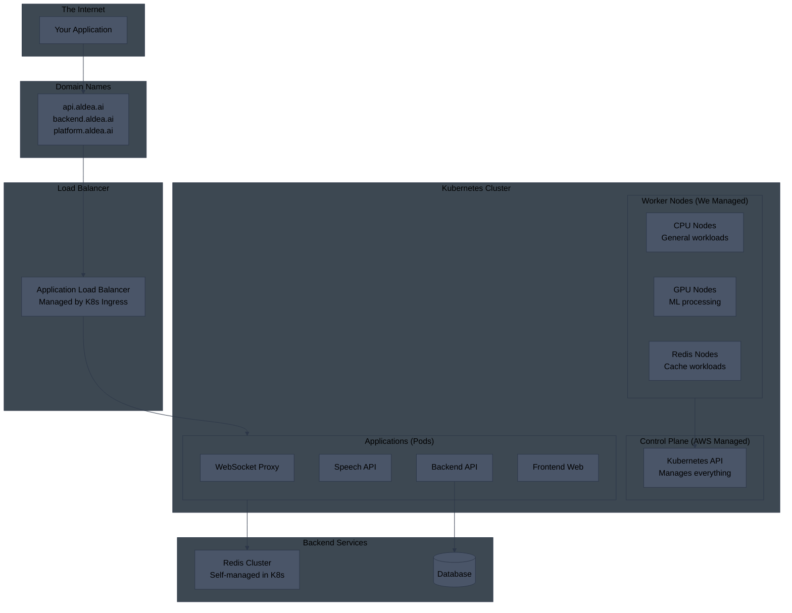
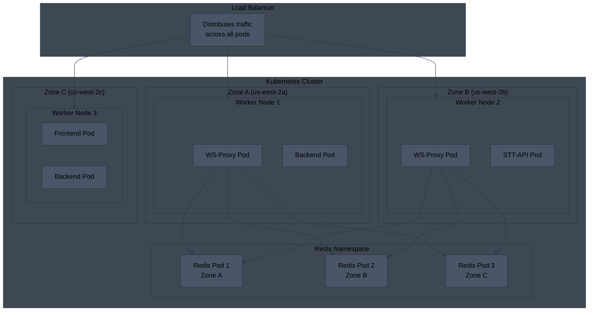
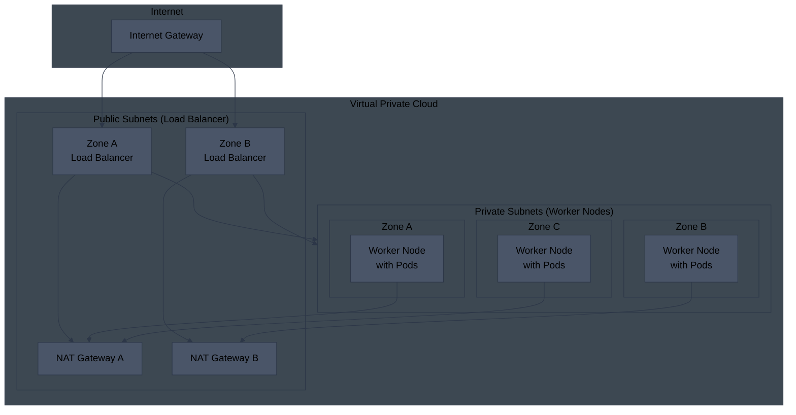
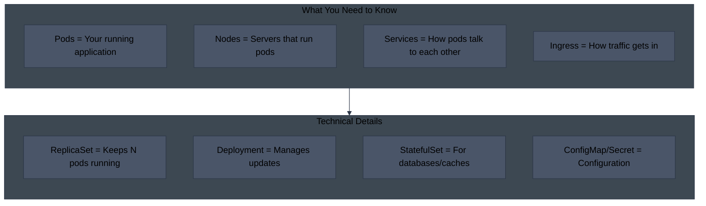
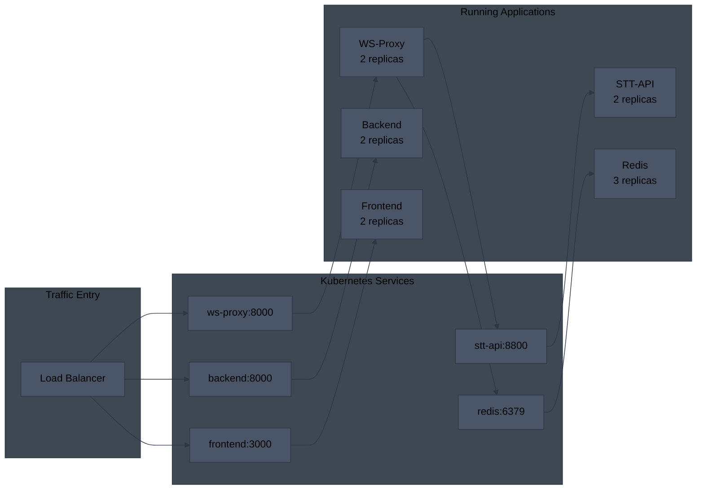
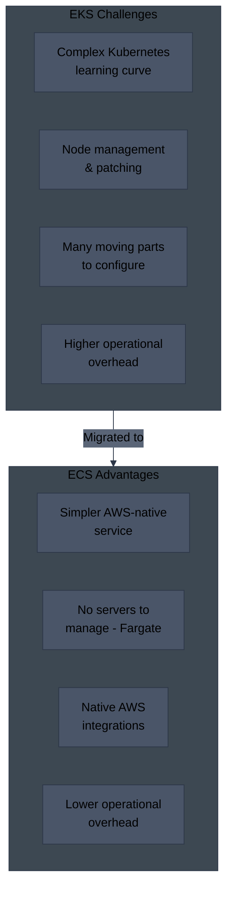
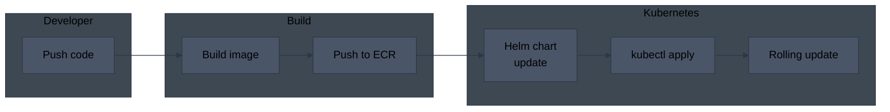

# Aldea EKS Architecture (Previous)

## What is This?

This document shows how Aldea's services **previously** ran using AWS EKS (Elastic Kubernetes Service). We migrated to ECS for simpler operations. This is kept for historical reference.

**Key Difference:** EKS uses Kubernetes (a complex container orchestration system) while ECS is AWS's simpler native container service.

---

## How Users Connected

---

## EKS Architecture Overview

A simplified view of the Kubernetes-based architecture:

---

## Pods Distributed Across Availability Zones

In Kubernetes, applications run in "Pods" which are scheduled across worker nodes in different availability zones:

---

## EKS Network Layout

How network traffic flows through subnets:

---

## Kubernetes Components Explained

---

## How Services Communicated

---

## Why We Moved Away from EKS

---

## Deployment Pipeline (EKS)

How code was deployed in the EKS era:

---

## EKS vs ECS Comparison

| Aspect | EKS (Before) | ECS (Now) |
|--------|--------------|-----------|
| **Complexity** | High - need K8s knowledge | Low - AWS native |
| **Servers** | Managed EC2 nodes | Serverless (Fargate) |
| **Scaling** | Pod autoscaler + node autoscaler | Simple service autoscaling |
| **Networking** | VPC CNI + kube-proxy | Simple awsvpc mode |
| **Load Balancing** | Ingress controller needed | Native ALB integration |
| **Secrets** | External Secrets operator | Direct Secrets Manager |
| **Cost Model** | Pay for nodes + EKS fee | Pay per task |
