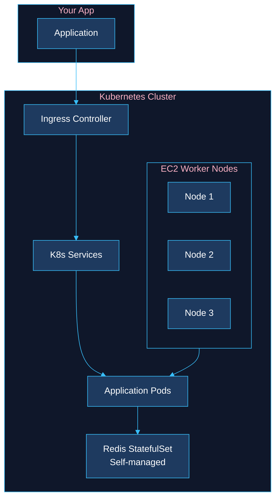
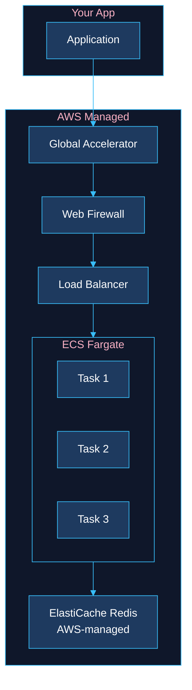
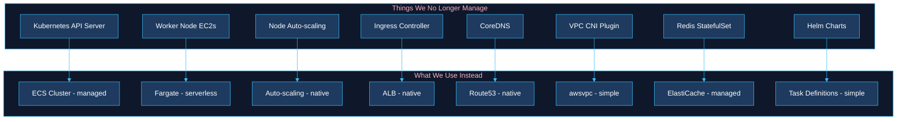
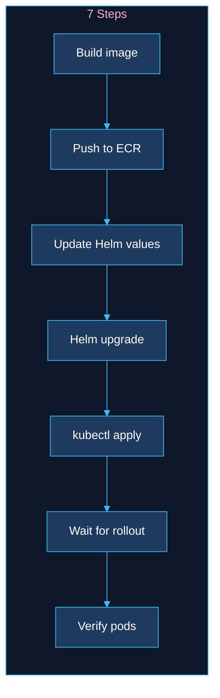
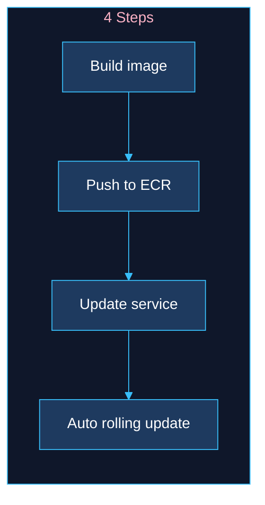
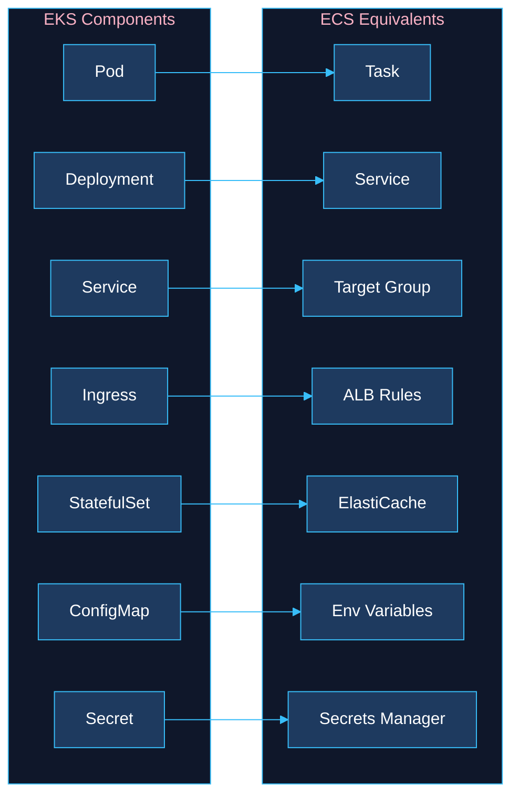
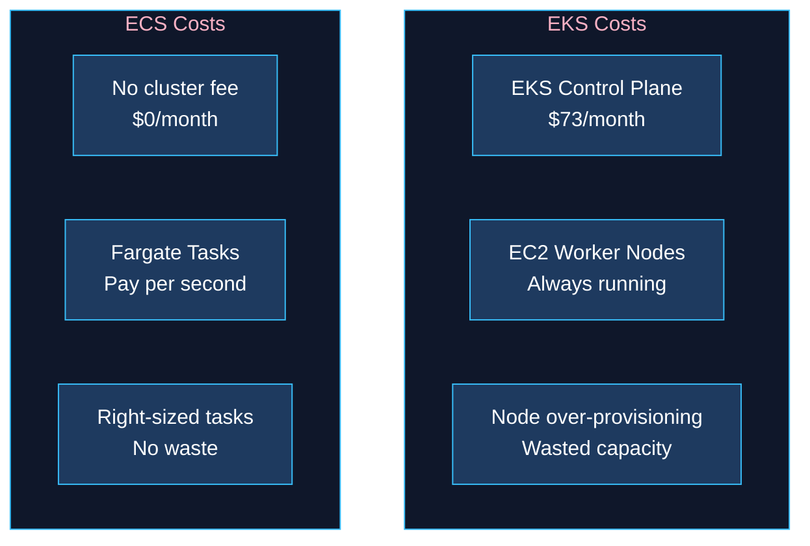
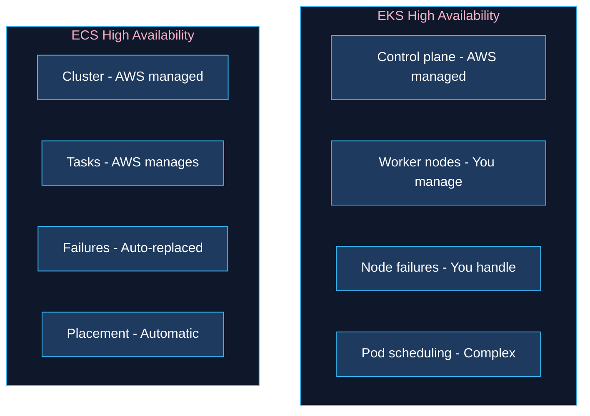
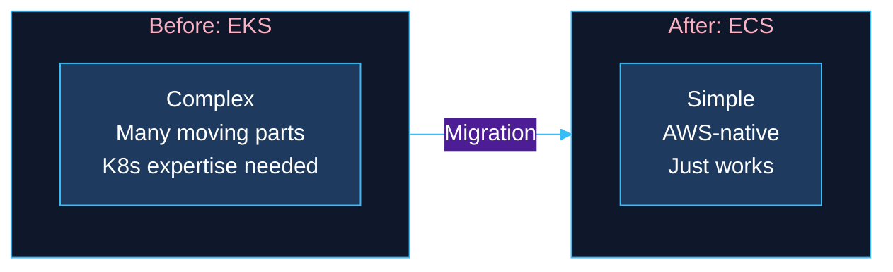

# EKS to ECS Migration: Side-by-Side Comparison

## What Changed?

We moved from Kubernetes (EKS) to AWS's simpler container service (ECS) to reduce complexity and operational overhead.

---

## Before & After Overview

```mermaid
%%{init: {'theme': 'base', 'themeVariables': { 'primaryColor': '#1e3a5f', 'primaryTextColor': '#fff', 'primaryBorderColor': '#38bdf8', 'lineColor': '#38bdf8', 'secondaryColor': '#4c1d95', 'tertiaryColor': '#064e3b', 'textColor': '#fff', 'clusterBkg': '#0f172a', 'clusterBorder': '#38bdf8'}}}%%
flowchart LR
    subgraph Before["BEFORE: Kubernetes (EKS)"]
        direction TB
        B1[Complex orchestration]
        B2[Managed EC2 servers]
        B3[Many K8s components]
        B4[Self-managed Redis]
    end

    subgraph After["AFTER: Containers (ECS)"]
        direction TB
        A1[Simple task definitions]
        A2[Serverless Fargate]
        A3[AWS-native services]
        A4[Managed ElastiCache]
    end

    Before -->|Simplified| After
```

---

## Architecture Comparison

### EKS (Before)

### ECS (After)

---

## What Got Simpler

---

## Deployment Comparison

### EKS Deployment (Complex)

### ECS Deployment (Simple)

---

## Service Mapping

What became what:

---

## Cost Model Change

---

## Reliability Comparison

---

## Quick Reference

| What | EKS Term | ECS Term |
|------|----------|----------|
| Running container | Pod | Task |
| Keep N running | Deployment | Service |
| Traffic routing | Ingress | ALB Listener Rules |
| Internal networking | K8s Service | Target Group |
| Configuration | ConfigMap | Environment Variables |
| Secrets | K8s Secret | Secrets Manager |
| Logs | kubectl logs | CloudWatch Logs |
| Scaling | HPA | Service Auto Scaling |

---

## Summary

**Bottom line:** We went from managing a complex Kubernetes cluster to using AWS-native services that "just work."
