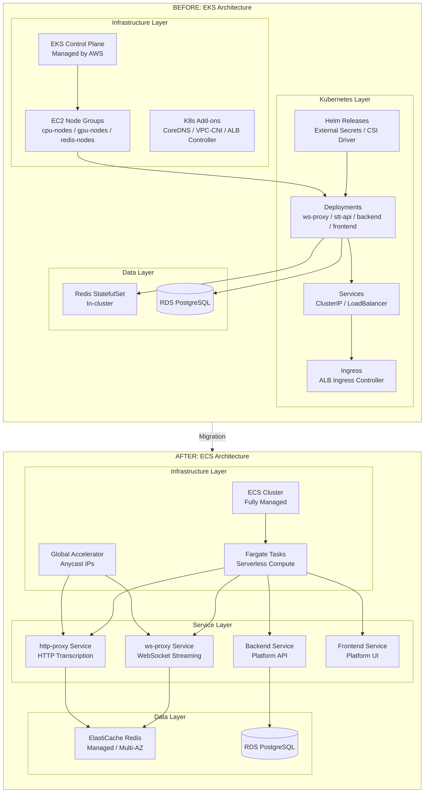
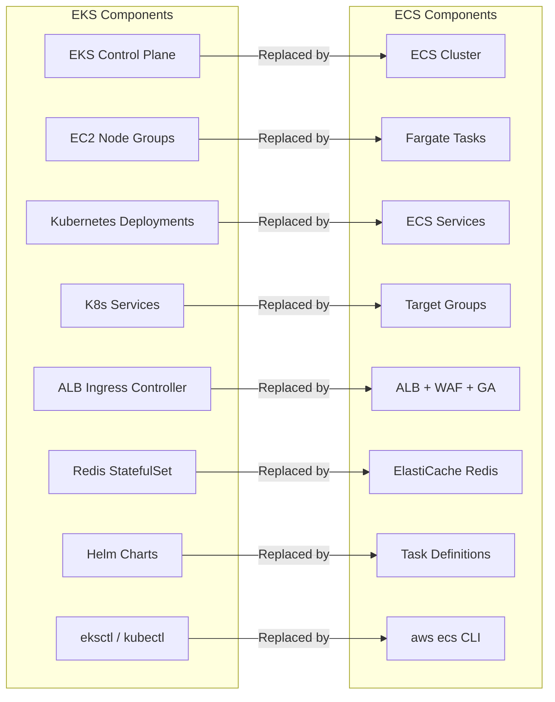
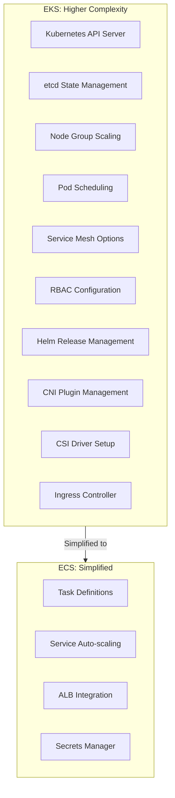
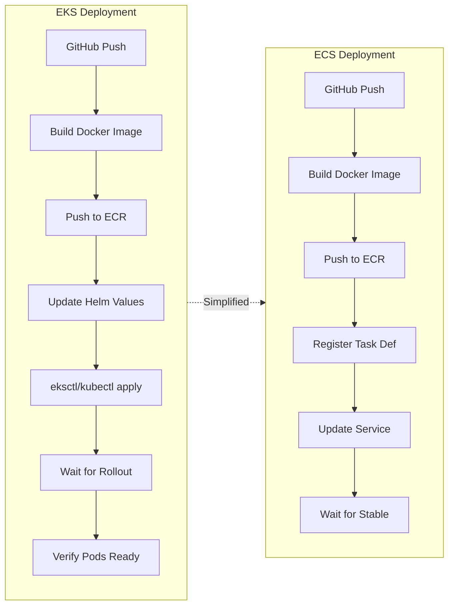
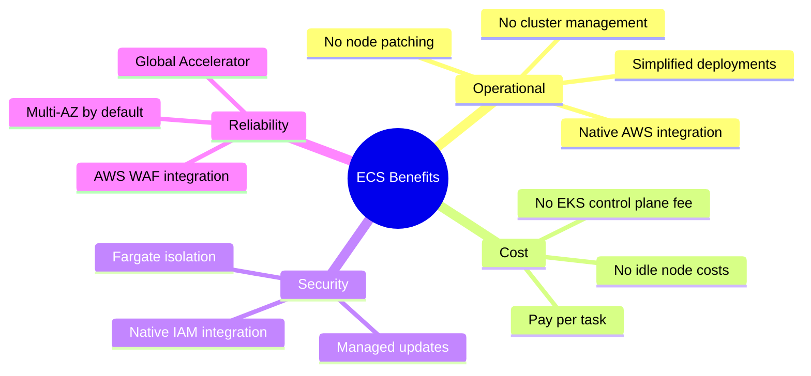

# EKS to ECS Migration Comparison

## Architecture Comparison

## Component Mapping

## Complexity Comparison

## Deployment Pipeline Comparison

## Network Architecture Comparison

```mermaid
flowchart TB
    subgraph EKS_Net["EKS Networking"]
        EN_USER[Users] --> EN_R53[Route53]
        EN_R53 --> EN_ALB[ALB]
        EN_ALB --> EN_ING[Ingress Controller]
        EN_ING --> EN_SVC[K8s Service]
        EN_SVC --> EN_POD[Pod]
        EN_POD --> EN_CNI[VPC CNI]
        EN_CNI --> EN_VPC[VPC Subnet]
    end

    subgraph ECS_Net["ECS Networking"]
        CN_USER[Users] --> CN_GA[Global Accelerator]
        CN_GA --> CN_WAF[AWS WAF]
        CN_WAF --> CN_ALB[ALB]
        CN_ALB --> CN_TG[Target Group]
        CN_TG --> CN_TASK[Fargate Task]
        CN_TASK --> CN_ENI[ENI in VPC]
    end
```

## Key Differences Summary

| Aspect | EKS | ECS |
|--------|-----|-----|
| **Compute** | EC2 Node Groups | Fargate (Serverless) |
| **Container Orchestration** | Kubernetes | ECS Native |
| **State Management** | etcd | AWS Managed |
| **Scaling** | HPA + Cluster Autoscaler | Service Auto Scaling |
| **Networking** | VPC CNI + kube-proxy | awsvpc mode |
| **Load Balancing** | ALB Ingress Controller | Native ALB Integration |
| **Secrets** | External Secrets + CSI | Secrets Manager Direct |
| **Service Discovery** | CoreDNS | Cloud Map (optional) |
| **Monitoring** | Prometheus + Grafana | CloudWatch + X-Ray |
| **Cost Model** | EC2 instances + EKS fee | Per-task pricing |
| **Complexity** | High (K8s knowledge required) | Low (AWS native) |
| **Flexibility** | Very High | Moderate |

## Benefits of Migration

## Services Mapping

### Production Environment

| Service | EKS (Before) | ECS (After) |
|---------|--------------|-------------|
| WebSocket Proxy | ws-proxy Deployment | ws-proxy-live1/live2 Services |
| HTTP Transcription | stt-api Deployment | http-proxy-live1/live2 Services |
| Platform Backend | imp-backend-api Deployment | imp-backend Service |
| Platform Frontend | imp-frontend Deployment | imp-frontend Service |
| DB Sync | sqs-data-updator Deployment | sqs-updater Service |
| Redis | Redis StatefulSet | ElastiCache Replication Group |

### Dev Environment

| Service | EKS (Before) | ECS (After) |
|---------|--------------|-------------|
| WebSocket Proxy | N/A | aldea-ecs-dev Service |
| HTTP Transcription | N/A | aldea-ecs-dev-transcribe Service |
| Platform Backend | N/A | aldea-ecs-dev-backend Service |
| Platform Frontend | N/A | aldea-ecs-dev-frontend Service |
| DB Sync | N/A | aldea-ecs-dev-sqs-updater Service |
