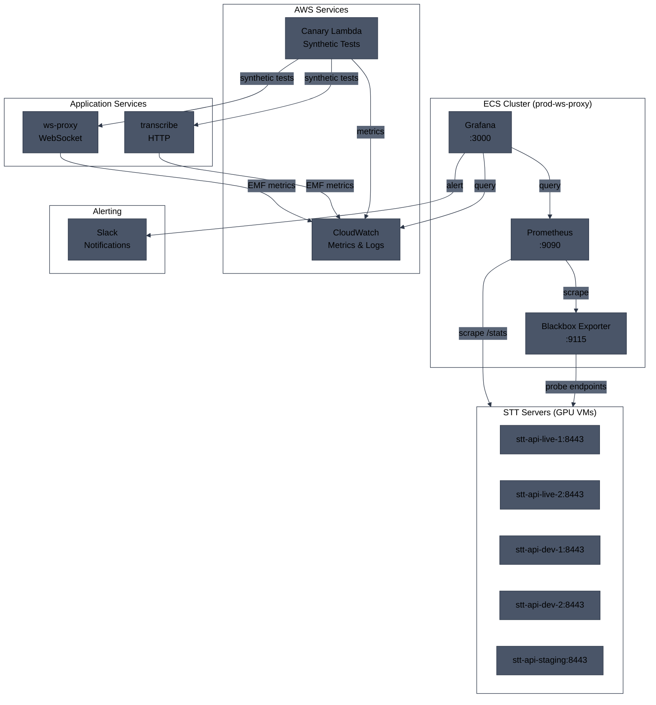
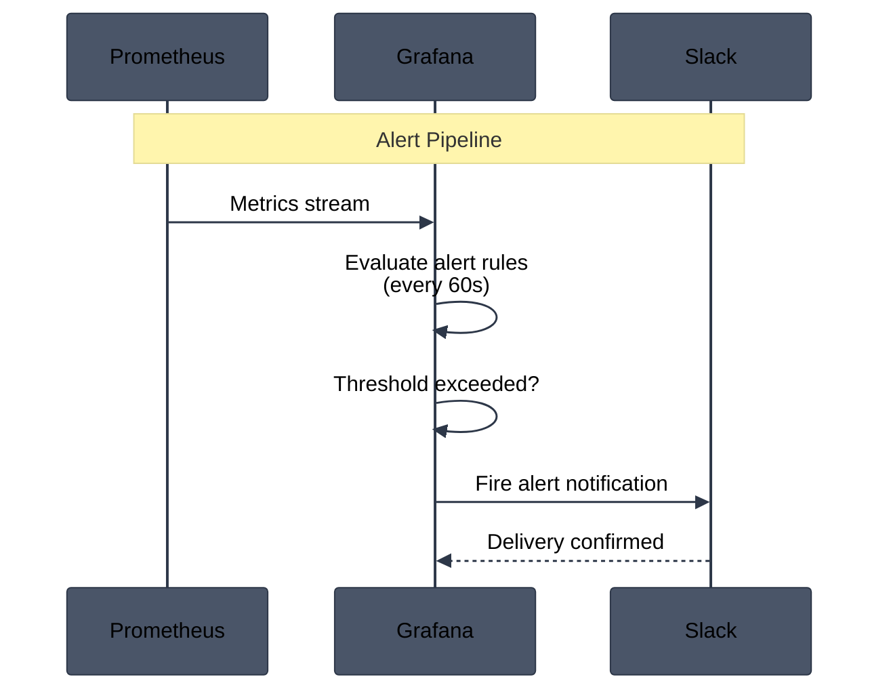
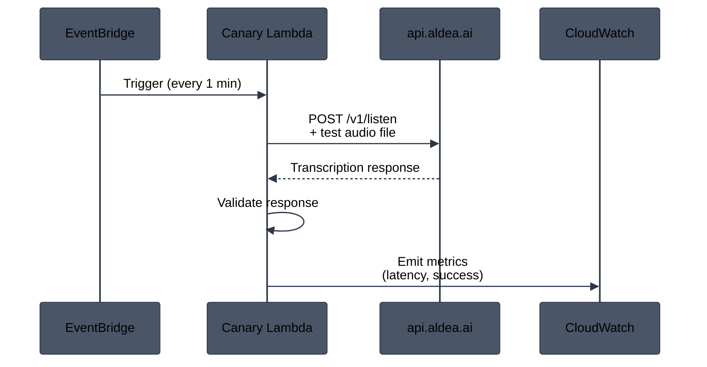
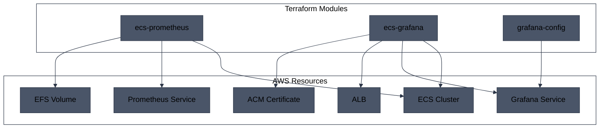

# Monitoring and Observability

## Overview

Aldea uses a comprehensive observability stack to monitor service health, performance, and reliability. The stack includes:

- **Prometheus** - Metrics collection and storage
- **Grafana** - Dashboards and alerting
- **Blackbox Exporter** - Endpoint probing
- **Lambda Canary** - Synthetic monitoring
- **CloudWatch EMF** - AWS-native metrics

---

## Monitoring Architecture



---

## Prometheus

Prometheus runs as an ECS service and scrapes metrics from STT servers.

### Configuration

| Setting | Value |
|---------|-------|
| **Service** | `prod-prometheus` |
| **Port** | 9090 |
| **Storage** | EFS persistent volume |
| **Retention** | 15 days |

### Scrape Targets

Prometheus scrapes the `/stats` endpoint from all STT servers:

```yaml
scrape_configs:
  - job_name: 'stt-servers'
    static_configs:
      - targets:
        - stt-api-live-1.aldea.ai:8443
        - stt-api-live-2.aldea.ai:8443
        - stt-api-dev-1.aldea.ai:8443
        - stt-api-dev-2.aldea.ai:8443
        - stt-api-dev-3.aldea.ai:8443
        - stt-api-staging.aldea.ai:8443
    scheme: https
```

### Key Metrics

| Metric | Description |
|--------|-------------|
| `probe_success` | Endpoint availability (1 = up, 0 = down) |
| `probe_duration_seconds` | Response time |
| `gpu_utilization` | GPU usage percentage |
| `gpu_memory_used_bytes` | GPU memory consumption |

---

## Grafana

Grafana provides dashboards and alerting, accessible at **grafana.aldea.ai**.

### Configuration

| Setting | Value |
|---------|-------|
| **Service** | `prod-grafana` |
| **Port** | 3000 |
| **Version** | 12.3.0 |
| **Auth** | Basic authentication |
| **URL** | grafana.aldea.ai |

### Data Sources

| Source | Type | Description |
|--------|------|-------------|
| Prometheus | prom_ds | STT server metrics |
| CloudWatch | P7F1562E1140037BF | AWS service metrics |

### Dashboards

| Dashboard | Description |
|-----------|-------------|
| **Blackbox Overview** | STT server availability and response times |
| **ECS Services** | Container CPU, memory, task counts |
| **SQS Processor** | Queue depths, Lambda invocations |

---

## Alerting

All alerts are managed through Grafana and include the environment name in their title (e.g., `[prod] blackbox-alert`).

### Alert Flow



### Alert Rules

#### Blackbox Alerts

| Alert | Condition | Severity |
|-------|-----------|----------|
| **[env] blackbox-alert** | `probe_success == 0` for 0s | Critical |

#### SQS Processor Alerts

| Alert | Condition | Severity |
|-------|-----------|----------|
| **[env] SQS Queue Depth High** | Messages > 100 for 3m | Warning |
| **[env] SQS DLQ Has Messages** | DLQ messages > 0 | Critical |
| **[env] Lambda Errors High** | Errors > 5 for 3m | Warning |

### Contact Points

Alerts are sent to Slack via webhook:

| Contact Point | Channel | Username |
|---------------|---------|----------|
| slack-contact-tf | Configured per environment | Grafana |

---

## Blackbox Exporter

Blackbox exporter probes STT server endpoints to verify availability.

### Configuration

| Setting | Value |
|---------|-------|
| **Service** | Part of Prometheus deployment |
| **Port** | 9115 |
| **Module** | http_2xx |

### Probe Targets

| Endpoint | Environment |
|----------|-------------|
| stt-api-live-1.aldea.ai:8443/stats | Production |
| stt-api-live-2.aldea.ai:8443/stats | Production |
| stt-api-dev-1.aldea.ai:8443/stats | Development |
| stt-api-dev-2.aldea.ai:8443/stats | Development |
| stt-api-dev-3.aldea.ai:8443/stats | Development |
| stt-api-staging.aldea.ai:8443/stats | Staging |

---

## Lambda Canary

A Lambda function performs synthetic monitoring by making actual transcription requests.

### Configuration

| Setting | Value |
|---------|-------|
| **Function** | `prod-ws-proxy-transcribe-canary` |
| **Schedule** | Every 1 minute |
| **Timeout** | 30 seconds |
| **Memory** | 256 MB |

### Test Flow



### Metrics Emitted

| Metric | Namespace | Description |
|--------|-----------|-------------|
| `TranscriptionLatency` | Aldea/Canary | Response time in ms |
| `TranscriptionSuccess` | Aldea/Canary | 1 = success, 0 = failure |
| `TranscriptionErrors` | Aldea/Canary | Error count |

---

## CloudWatch EMF Metrics

Application services emit Embedded Metric Format (EMF) metrics to CloudWatch.

### Namespaces

| Namespace | Source | Description |
|-----------|--------|-------------|
| Aldea/ProxyServices | ws-proxy, transcribe | Request counts, latency, errors |
| Aldea/Canary | Canary Lambda | Synthetic test results |
| AWS/ECS | ECS | Container CPU, memory, task counts |
| AWS/SQS | SQS | Queue depths, message counts |
| AWS/Lambda | Lambda | Invocations, errors, duration |

### Key Metrics

#### Proxy Services (Aldea/ProxyServices)

| Metric | Dimensions | Description |
|--------|------------|-------------|
| `RequestCount` | Service, Endpoint | Total requests |
| `RequestLatency` | Service, Endpoint | Response time |
| `ErrorCount` | Service, ErrorType | Error occurrences |
| `ConnectionCount` | Service | Active WebSocket connections |

#### ECS (AWS/ECS)

| Metric | Dimensions | Description |
|--------|------------|-------------|
| `CPUUtilization` | ClusterName, ServiceName | CPU percentage |
| `MemoryUtilization` | ClusterName, ServiceName | Memory percentage |
| `RunningTaskCount` | ClusterName, ServiceName | Active tasks |

---

## Observability Stack Deployment

The monitoring stack is deployed via Terraform in the `prod-ecs` environment.

### Terraform Modules

```
terraform/
  envs/
    prod-ecs/
      grafana-ecs.tf       # Prometheus, Grafana, Grafana Config
  modules/
    ecs-prometheus/        # Prometheus ECS service
    ecs-grafana/           # Grafana ECS service
    grafana-config/        # Dashboards and alerts
```

### Service Dependencies



---

## Accessing Monitoring Tools

| Tool | URL | Auth |
|------|-----|------|
| **Grafana** | https://grafana.aldea.ai | Basic auth |
| **Prometheus** | Internal only (via Grafana) | N/A |

### Grafana Access

1. Navigate to https://grafana.aldea.ai
2. Log in with admin credentials (stored in Secrets Manager)
3. Access dashboards from the sidebar

---

## Troubleshooting

### No Metrics in Grafana

1. Check Prometheus is running:
   ```bash
   AWS_PROFILE=aldea-prod aws ecs describe-services \
     --cluster prod-ws-proxy \
     --services prod-prometheus \
     --region us-west-2
   ```

2. Verify scrape targets in Prometheus UI (internal)

3. Check ECS task logs:
   ```bash
   AWS_PROFILE=aldea-prod aws logs tail /ecs/prod-prometheus \
     --follow --region us-west-2
   ```

### Alerts Not Firing

1. Verify Slack webhook URL is configured in Terraform variables
2. Check Grafana alert rules are enabled
3. Review alert evaluation in Grafana UI (Alerting > Alert rules)

### Canary Failures

1. Check Lambda logs:
   ```bash
   AWS_PROFILE=aldea-prod aws logs tail \
     /aws/lambda/prod-ws-proxy-transcribe-canary \
     --follow --region us-west-2
   ```

2. Verify test audio file exists in Lambda deployment package
3. Check API endpoint is accessible from Lambda VPC
