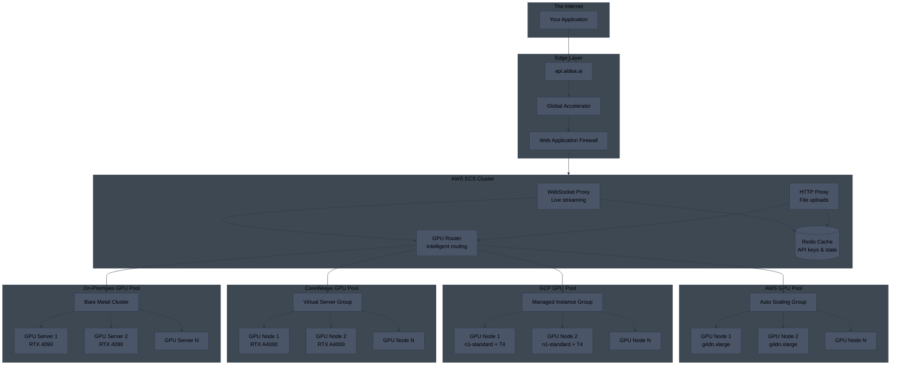
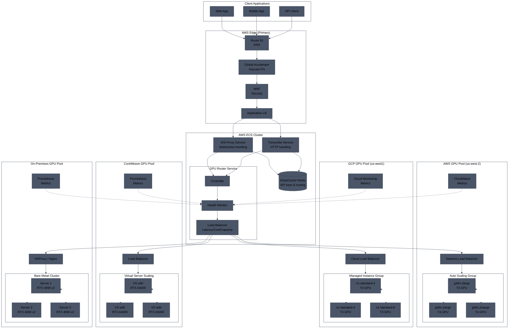
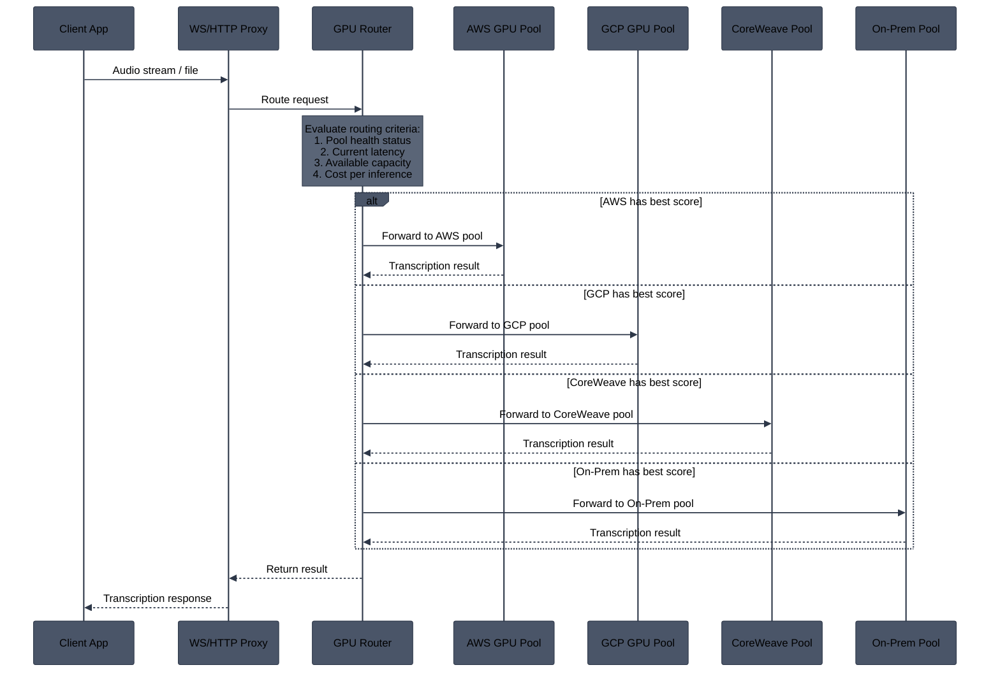
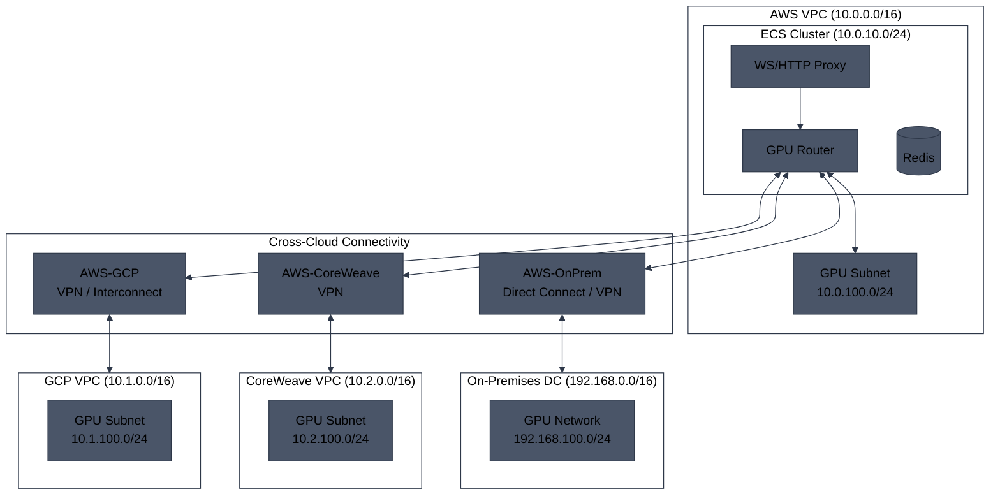
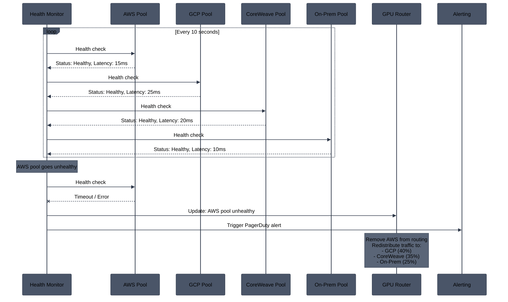
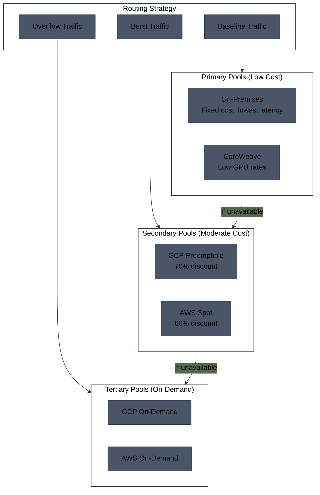

# Multi-Cloud GPU Backend Architecture

## Overview

This document shows a proposed architecture for distributing GPU workloads across multiple cloud providers. Traffic is routed through a central load balancer to Auto Scaling Groups (ASGs) on different providers, enabling cost optimization, redundancy, and capacity flexibility.

---

## High-Level Architecture

---

## Detailed Multi-Cloud Architecture

---

## Request Flow

---

## Auto Scaling Configuration by Provider

### AWS Auto Scaling Group

```mermaid
%%{init: {'theme': 'base', 'themeVariables': { 'primaryColor': '#4a5568', 'primaryTextColor': '#000', 'primaryBorderColor': '#2d3748', 'lineColor': '#2d3748', 'clusterBkg': 'transparent', 'clusterBorder': '#2d3748', 'titleColor': '#000'}}}%%
flowchart LR
    subgraph Triggers["Scaling Triggers"]
        CW_CPU[CPU Utilization > 70%]
        CW_GPU[GPU Utilization > 80%]
        CW_QUEUE[Request Queue > 100]
    end

    subgraph ASG["Auto Scaling Group"]
        direction TB
        MIN[Min: 2 instances]
        DES[Desired: 4 instances]
        MAX[Max: 20 instances]
    end

    subgraph Instances["GPU Instances"]
        G1[g4dn.xlarge]
        G2[g4dn.xlarge]
        G3[g4dn.xlarge]
        G4[g4dn.xlarge]
    end

    subgraph NLB["Network Load Balancer"]
        TG[Target Group<br/>Health checks]
    end

    Triggers --> ASG
    ASG --> Instances
    Instances --> TG
```

### GCP Managed Instance Group

```mermaid
%%{init: {'theme': 'base', 'themeVariables': { 'primaryColor': '#4a5568', 'primaryTextColor': '#000', 'primaryBorderColor': '#2d3748', 'lineColor': '#2d3748', 'clusterBkg': 'transparent', 'clusterBorder': '#2d3748', 'titleColor': '#000'}}}%%
flowchart LR
    subgraph Triggers["Autoscaler Signals"]
        CM_CPU[CPU > 70%]
        CM_GPU[GPU Duty Cycle > 80%]
        CM_CUSTOM[Custom Metric]
    end

    subgraph MIG["Managed Instance Group"]
        direction TB
        MIN[Min: 2 instances]
        TARGET[Target: 4 instances]
        MAX[Max: 20 instances]
    end

    subgraph VMs["GPU VMs"]
        VM1[n1-standard-4 + T4]
        VM2[n1-standard-4 + T4]
        VM3[n1-standard-4 + T4]
        VM4[n1-standard-4 + T4]
    end

    subgraph GLB["Cloud Load Balancer"]
        BE[Backend Service<br/>Health checks]
    end

    Triggers --> MIG
    MIG --> VMs
    VMs --> BE
```

### CoreWeave Scaling

```mermaid
%%{init: {'theme': 'base', 'themeVariables': { 'primaryColor': '#4a5568', 'primaryTextColor': '#000', 'primaryBorderColor': '#2d3748', 'lineColor': '#2d3748', 'clusterBkg': 'transparent', 'clusterBorder': '#2d3748', 'titleColor': '#000'}}}%%
flowchart LR
    subgraph Triggers["Kubernetes HPA"]
        PROM_CPU[CPU Request > 70%]
        PROM_GPU[GPU Utilization > 80%]
        PROM_QUEUE[Pending Requests > 50]
    end

    subgraph HPA["Horizontal Pod Autoscaler"]
        direction TB
        MIN[Min: 2 pods]
        TARGET[Target: 4 pods]
        MAX[Max: 20 pods]
    end

    subgraph Pods["GPU Pods"]
        P1[Pod + RTX A4000]
        P2[Pod + RTX A4000]
        P3[Pod + RTX A4000]
        P4[Pod + RTX A4000]
    end

    subgraph SVC["Kubernetes Service"]
        LB[LoadBalancer Service<br/>Health probes]
    end

    Triggers --> HPA
    HPA --> Pods
    Pods --> LB
```

### On-Premises Scaling

```mermaid
%%{init: {'theme': 'base', 'themeVariables': { 'primaryColor': '#4a5568', 'primaryTextColor': '#000', 'primaryBorderColor': '#2d3748', 'lineColor': '#2d3748', 'clusterBkg': 'transparent', 'clusterBorder': '#2d3748', 'titleColor': '#000'}}}%%
flowchart LR
    subgraph Triggers["Prometheus Alerts"]
        ALERT_CPU[CPU Alert]
        ALERT_GPU[GPU Alert]
        ALERT_QUEUE[Queue Depth Alert]
    end

    subgraph Scaling["Manual / Semi-Auto Scaling"]
        direction TB
        FIXED[Fixed capacity pool]
        RESERVE[Reserved overflow nodes]
        MANUAL[Manual intervention]
    end

    subgraph Servers["Bare Metal Servers"]
        S1[Server 1<br/>RTX 4090 x2]
        S2[Server 2<br/>RTX 4090 x2]
        S3[Server 3<br/>RTX 4090 x2]
        S4[Server 4<br/>Reserved]
    end

    subgraph LB["HAProxy"]
        BE[Backend Pool<br/>Health checks]
    end

    Triggers --> Scaling
    Scaling --> Servers
    Servers --> BE
```

---

## Network Connectivity

---

## Health Monitoring & Failover

---

## Provider Comparison

| Aspect | AWS | GCP | CoreWeave | On-Premises |
|--------|-----|-----|-----------|-------------|
| **GPU Types** | T4, A10G, A100 | T4, A100, L4 | RTX A4000/A5000, A100 | RTX 4090, A6000 |
| **Scaling** | ASG (auto) | MIG (auto) | HPA (auto) | Manual / semi-auto |
| **Min Latency** | ~15ms | ~25ms | ~20ms | ~10ms |
| **Spot/Preemptible** | Yes | Yes | Yes | N/A |
| **Cost (relative)** | $$ | $$ | $ | Fixed |
| **Burst Capacity** | High | High | Medium | Low |
| **Reliability** | 99.99% | 99.99% | 99.9% | Depends on setup |

---

## Cost Optimization Strategies

---

## Implementation Phases

### Phase 1: Foundation
- Deploy GPU router service
- Set up AWS ASG with health checks
- Implement basic round-robin routing

### Phase 2: Multi-Cloud
- Add GCP Managed Instance Group
- Add CoreWeave Kubernetes cluster
- Implement latency-based routing

### Phase 3: On-Premises
- Set up on-prem GPU cluster
- Configure VPN/Direct Connect
- Add to routing pool

### Phase 4: Optimization
- Implement cost-aware routing
- Add spot/preemptible instance support
- Fine-tune autoscaling policies
